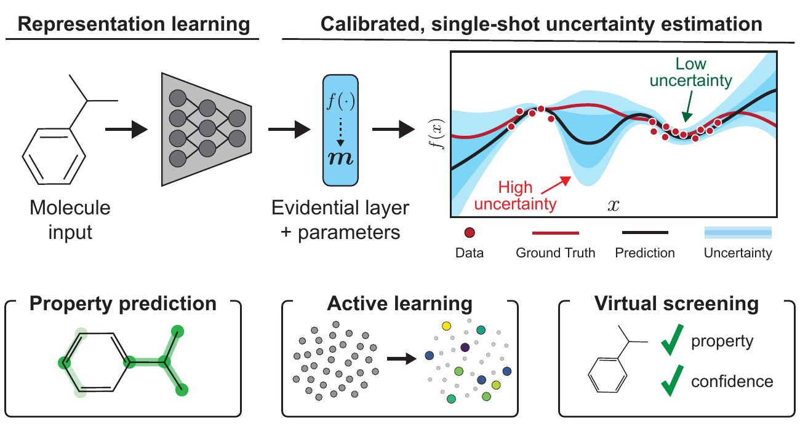

<h1 align="center">Evidential Deep Learning for Guided Molecular Property Prediction and Discovery</h1>
<h4 align="center">Ava Soleimany*, Alexander Amini*, Samuel Goldman*, Daniela Rus, Sangeeta Bhatia, Connor Coley</h4>

<p align="center"> [<b><a href="https://pubs.acs.org/doi/10.1021/acscentsci.1c00546">Paper</a></b>] &emsp; [<b><a href="#citation">Citation</a></b>] </p>




The repository contains all of the code and instructions needed to reproduce the experiments and results of **[Evidential Deep Learning for Guided Molecular Property Prediction and Discovery](https://pubs.acs.org/doi/10.1021/acscentsci.1c00546)**. We detail the changes we have made in the [Evidential Uncertainty](#evidential-uncertainty) section of this README. We acknowledge the original [Chemprop repository](https://pubs.acs.org/doi/pdf/10.1021/acs.jcim.0c00502?casa_token=dUy7JEOj9Y4AAAAA:8s14xrMIr020lqI3mFF8t-mG_U4TtaCd1Kv-3ECkksQZUnzS5uAiKi2qg1xFUTMQonDnmuzOB2Qrsdw) which this code leveraged and built on top of.

For setup instructions for the broader chemprop repository (as a prerequisite to our changes), please refer to the complete [Chemprop setup guide](README_chemprop.md).

## Evidential Uncertainty

 This fork implements message passing neural networks with [Deep Evidential Regression](https://arxiv.org/pdf/1910.02600.pdf). The changes made to implement evidential uncertainty can be found in:

1. **Model modifications:** Because the evidential model requires outputting 4 auxilary parameters of the evidential distribution for every single desired target, we have modified `chemprop/model/model.py`.
2. **Predicting uncertainty:** The predict module in `chemprop/train/predict.py` has been modified to convert these four parmaeters into an uncertainty prediction.
3. **Loss function:** The evidential loss function can be found in `chemprop/utils.py`. We note that the most up to date version of this loss function is accessed using the `--new_loss` flag.
4. **Addition of SchNet support:** In order to demonstrate evidential uncertainty on SchNet, we have integrated the SchNet package into the Chemprop training procedure by modifying `chemprop/model/model.py` and `chemprop/train/run_training.py`. `train_atomistic.py` serves as an entrypoint to use this model. Demonstrations for benchmarking with this model can be fund in the [Benchmarking](#benchmarking) section.

### Training a Model

To train a method with evidential regression on a dataset, the following command can be run:

`python train.py --confidence evidence --epochs 20 --new_loss --regularizer_coeff 0.2 --save_dir results/evidence_demo --save_confidence conf.txt --confidence_evaluation_methods cutoff --split_type random --split_sizes 0.8 0.1 0.1 --seed 0 --dataset_type regression --data_path data/delaney.csv`

This will run 20 epochs of training an evidence regression model on the delaney dataset, saving the results of the run in the conf.txt file.

Note: The new\_loss flag is necessary to use the most up to date version of the evidential loss, which was used to produce all results in our paper.

### Evidence Comparison Demo

For a simple demonstration of the pipeline to reproduce benchmarking plots, we've prepared a configuration file to run 2 trials of dropout, ensembles, and evidential regression for an abridged 20 epochs of training on the small, Delaney dataset, which can be be completed in under 20 minutes on a CPU. This can be run using the command:

`python scripts/run_benchmarking.py configs/reproducibility/delaney_demo.json`

To consolidate the results from this demo:

`python scripts/combine_conf_outputs.py --dataset-dir results/delaney_demo/random  --outfile results/delaney_demo/consolidated_delaney_demo --result-type low_n`

To produce figures from the results of this demo:

`python scripts/make_figs.py --full-data-file  results/delaney_demo/consolidated_delaney_demo.tsv --summary-data-file results/delaney_demo/consolidated_delaney_demo_summary_calc.tsv --plot-type low_n --outdir results/delaney_demo/figures`

This will generate figures in the folder `results/delaney_demo/figures/low_n`. Please note that all tuning plots will show no results, as this demonstration uses only a single evidence coefficient.

### Benchmarking

To reproduce all benchmarking plots, we provide the following config files, which are currently configured to use a SLURM scheduler for parallelization and take advantage of GPU support.

1. **Generating Benchmarking:** The following config files can all be run using the command `python scripts/run_benchmarking.py [config_name]`  
    * `configs/reproducibility/low_n_config.json`  
    * `configs/reproducibility/high_n_config.json`  
    * `configs/reproducibility/atomistic_config.json`  
    * `configs/reproducibility/classif_config.json`  

These configs will each generate logs for the different trials respectively. The low N config will conduct a sweep over various evidential loss coefficient weights in order to generate the corresponding tuning plots. The config file can be modified by setting `use_slurm` to false in order to avoid using the SLURM launcher.

2. **Combining Results:** Results from the different benchmarking trials can be combined using the various labeled commands in the script `scripts/combine_benchmarking.sh`. To avoid using SLURM, these can be individually copied and run without the `srun` prefix.

3. **Generating figures:** The figures for the different dataset types can be generated with commands listed in the script `make_all_figs.sh`. Once again, this takes advantage of the SLURM launcher, but can be used directly by removing the `srun` flags.

### Active Learning

To execute an active learning experiment on the QM9 dataset, as shown in the paper, variants of the following command can be executed. The commands in the following examples will launch a signle trial of an active learning experiment, in which an explorative acquisition strategy, i.e., wherein data points with the greatest uncertainties are prioritized for selection, is compared to a random acquisition strategy. The `active_learning.py` script contains the code to execute these experiments. Multiple trials can be parallelized to generate performance statistics. For example,

`python active_learning.py --confidence evidence --new_loss regularizer_coeff 0.2 --batch_size 50 --epochs 100 --num_al_loops 7 --al_init_ratio 0.15 --al_strategy explorative --data_path ./data/qm9.csv --dataset_type regression --save_dir logs/qm9/evidence --save_confidence conf.txt --split_type random --use_std --use_entropy --quiet`

will execute two complete active learning loops starting from 15\% of the entire training set and iteratively acquiring 7 batches of data based on an explorative evidence-based strategy. `--al_strategy` can be switch to `random` to run baselines against a random acquisition strategy. Once trained, logs can be passed into `scripts/plot_al_results_cutoff.py` to reproduce the relevant plots from the manuscript.

This execution will yield `.csv` files containing performance metrics (i.e., RMSE) as a function of training set size, with the acquisition strategy delineated. To plot the results of an active learning experiment, the following command can be run:

`python scripts/plot_al_results_cutoff.py --path [/path/to/logs ...]`

where `[/path/to/logs ...]` should have a sub-directory of the form `[dataset]/[method]/scores`, where dataset is the specified dataset, i.e., QM9.

### Stokes Analysis

The presented analysis on the datasets from [Stokes et al. Cell 2020](https://www.sciencedirect.com/science/article/abs/pii/S0092867420301021?via%3Dihub) can be summarized as follows:

1. **Train:** An evidential D-MPNN is trained on the primary dataset reported by Stokes et al. of small molecules and their *in vitro* antibiotic activity against *Escherichia coli*, measured as the optical density at a wavelength of 600 nm (OD600), where smaller OD600 values correspond to greater antibiotic activity of the associated small molecule. We train an evidential D-MPNN for regression, where the target is the OD600 for a particular small molecule input.
2. **Predict:** The trained evidential D-MPNN is then evaluated on an independent test set, the Broad Institute's [Drug Repurposing Hub](https://www.broadinstitute.org/drug-repurposing-hub). The model predicts a continuous target, predicted OD600, directly from a SMILES string molecule input, as well as an associated evidential uncertainty. For a subset of molecules from the Drug Repurposing Hub, there exist experimental measurements of their true *in vitro* antibiotic activity against *E. coli*, as reported by Stokes et al. The subset of molecules for which experimental annotations are available are the focus of the analysis in (3).
3. **Prioritize:** The top-k (k=50 for the results in the paper) ranking predictions from (2) are considered, and confidence filters, determined by the distribution of predicted evidential uncertainties from (2), are applied to filter the list of candidates. The experimental hit rate is determined by calculating the overlap between the filtered list of candidates and those repurposing molecules experimentally measured to result in an OD600 < 0.2 in the real world (active antibiotic).

The analysis presented in the paper uses a D-MPNN based on that from Stokes et al., which includes augmentation with pre-computed features from RDKit. First to compute the features, the [`descriptastorus`](https://anaconda.org/RMG/descriptastorus) must be installed. To compute the features for both the Stokes primary data and the Broad repurposing library:

`
python scripts/save_features.py --features_generator rdkit_2d_normalized --data_path data/stokes_primary_regr.csv --save_path features/stokes_primary_regr
`

`
python scripts/save_features.py --features_generator rdkit_2d_normalized --data_path data/broad_smiles_validated_full.csv --save_path features/stokes_broad
`

**Step 1: Train.** This will train an evidential regression D-MPNN on the Stokes primary dataset. Data are sampled to adjust for label imbalance according to the OD600 < 0.2 cutoff. Experiments are run with 30 epochs, 10 fold cross-validation, 20 independent trials with varying random seeds, data balancing probability of 0.1, and evidential regularization coefficient of 0.1.

`
python train.py --data_path=data/stokes_primary_regr.csv  --dataset_type=regression --split_type=random --save_smiles_splits --save_confidence conf.txt --features_path features/stokes_primary_regr.npz --seed [RANDOM] --no_features_scaling --num_folds 10 --confidence=evidence --new_loss --epochs 30 --regularizer_coeff 0.1 --stokes_balance 0.1 save_dir=logs/stokes/evidence_30_0.1_0.1
`

**Step 2: Predict.** This will utilize the trained evidential regression D-MPNN for prediction of antibiotic activity and uncertainty on the Broad Repurposing Hub dataset.

`
python predict.py --test_path data/broad_smiles_validated_full.csv --features_path features/stokes_broad.npz --preds_path logs/stokes/evidence_30_0.1_0.1/broad/predictions_[RANDOM].csv --checkpoint_dir logs/stokes/evidence_30_0.1_0.1/[checkpoint]
`

**Step 3: Prioritize & Evaluate.** This will take the resulting predictions and perform the confidence-based prioritization described above to reproduce the plots shown.

`
python scripts/stokes_figures.py --use_stds --preds_path logs/stokes --method evidence_30_0.1_0.1
`

## Predicting

To load a trained model and make predictions, run `predict.py` and specify:
* `--test_path <path>` Path to the data to predict on.
* A checkpoint by using either:
  * `--checkpoint_dir <dir>` Directory where the model checkpoint(s) are saved (i.e. `--save_dir` during training). This will walk the directory, load all `.pt` files it finds, and treat the models as an ensemble.
  * `--checkpoint_path <path>` Path to a model checkpoint file (`.pt` file).
* `--preds_path` Path where a CSV file containing the predictions will be saved.

For example:
```
python predict.py --test_path data/tox21.csv --checkpoint_dir tox21_checkpoints --preds_path tox21_preds.csv
```
or
```
python predict.py --test_path data/tox21.csv --checkpoint_path tox21_checkpoints/fold_0/model_0/model.pt --preds_path tox21_preds.csv
```

## Citation

If you use the results presented in this paper or the code from the repository, please cite the relevant [paper](https://pubs.acs.org/doi/10.1021/acscentsci.1c00546):
```
@article{soleimany2021evidential,
  title={Evidential Deep Learning for Guided Molecular Property Prediction and Discovery},
  author={Soleimany, Ava P and Amini, Alexander and Goldman, Samuel and Rus, Daniela and Bhatia, Sangeeta and Coley, Connor},
  journal={ACS Central Science},
  year={2021},
  publisher={ACS Publications}
}
```
